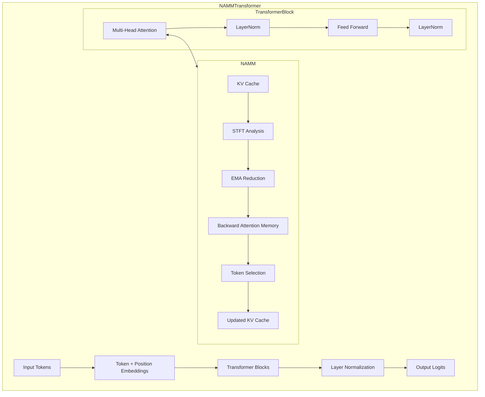
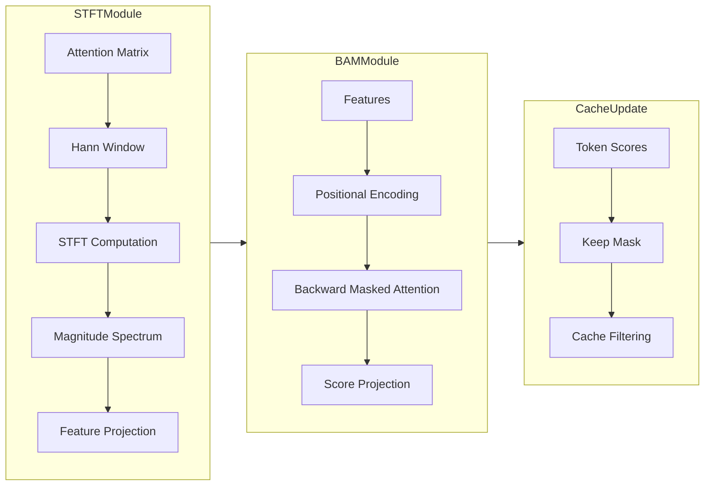

# [Paper Implementation] AN EVOLVED UNIVERSAL TRANSFORMER MEMORY

[](https://discord.gg/agora-999382051935506503) [](https://www.youtube.com/@kyegomez3242) [](https://www.linkedin.com/in/kye-g-38759a207/) [](https://x.com/kyegomezb)

An open source implementation of the paper: "AN EVOLVED UNIVERSAL TRANSFORMER MEMORY"


Abstract:

Prior methods propose to offset the escalating costs of modern foundation models by dropping specific parts of their contexts with hand-designed rules, while attempting to preserve their original performance. We overcome this trade-off with Neural Attention Memory Models (NAMMs), introducing a learned network for memory management that improves both the performance and efficiency of transformers. We evolve NAMMs atop pre-trained transformers to provide different latent contexts focusing on the most relevant information for individual layers and attention heads. NAMMs are universally applicable to any model using selfattention as they condition exclusively on the values in the produced attention matrices. Learning NAMMs on a small set of problems, we achieve substantial performance improvements across multiple long-context benchmarks while cutting the model’s input contexts up to a fraction of the original sizes. We show the generality of our conditioning enables zero-shot transfer of NAMMs trained only on language to entirely new transformer architectures even across input modalities, with their benefits carrying over to vision and reinforcement learning.


## Install

```bash
$ pip3 install -U open-namm
```


### Full Transformer

```python

# Add transformer demo to main function
from loguru import logger
import torch

from open_namm.main import (
    NAMMConfig,
    TransformerConfig,
    create_namm,
    create_namm_transformer,
)


def main():
    """Main function demonstrating NAMM and Transformer usage."""
    # [Previous main function code remains the same until the end]
    # Create NAMM instance with custom config
    config = NAMMConfig(
        update_interval=256,  # More frequent updates for demonstration
        stride_size=16,
        window_size=64,
        d_model=256,
        n_head=4,
        gamma=0.95,
        dropout=0.1,
    )

    create_namm(config)
    device = "cuda" if torch.cuda.is_available() else "cpu"

    # Add transformer demo
    logger.info("Starting transformer demo...")

    # Create transformer config
    transformer_config = TransformerConfig(
        vocab_size=1000,  # Smaller vocab for demo
        max_seq_length=128,
        d_model=256,
        n_heads=4,
        n_layers=2,
        use_namm=True,
        namm_config=config,  # Reuse NAMM config from above
    )

    # Create transformer
    transformer = create_namm_transformer(transformer_config)
    transformer = transformer.to(device)

    # Create sample input
    batch_size = 2
    seq_len = 64
    input_ids = torch.randint(
        0,
        transformer_config.vocab_size,
        (batch_size, seq_len),
        device=device,
    )

    # Forward pass
    logits = transformer(input_ids)

    logger.info(
        f"Transformer forward pass successful. "
        f"Output shape: {logits.shape}"
    )


if __name__ == "__main__":
    main()


```

## Usage

```python
from loguru import logger
import torch
from open_namm.main import NAMMConfig, create_namm


def create_sample_inputs(
    batch_size: int = 2,
    seq_len: int = 1024,
    n_queries: int = 512,
    d_model: int = 256,
    device: str = "cuda" if torch.cuda.is_available() else "cpu",
) -> tuple[dict[str, torch.Tensor], torch.Tensor]:
    """Create sample inputs for NAMM testing.

    Args:
        batch_size: Batch size
        seq_len: Sequence length (number of tokens in KV cache)
        n_queries: Number of recent queries
        d_model: Model dimension
        device: Device to create tensors on

    Returns:
        Tuple of (kv_cache, attention_matrix)
    """
    logger.info(f"Creating sample inputs on device: {device}")

    # Create sample KV cache
    # In practice, these would be the key and value tensors from transformer layers
    kv_cache = {
        "key": torch.randn(
            batch_size, seq_len, d_model, device=device
        ),
        "value": torch.randn(
            batch_size, seq_len, d_model, device=device
        ),
    }

    # Create sample attention matrix
    # In practice, this would be the recent attention scores from transformer layers
    attention_matrix = torch.randn(
        batch_size, seq_len, n_queries, device=device
    )

    # Apply softmax to make it look like real attention scores
    attention_matrix = torch.softmax(attention_matrix, dim=1)

    logger.info(
        f"Created inputs - KV cache size: {kv_cache['key'].shape}, "
        f"Attention matrix size: {attention_matrix.shape}"
    )

    return kv_cache, attention_matrix


def main():
    """Main function demonstrating NAMM usage."""
    # Setup logging
    logger.remove()
    logger.add(
        lambda msg: print(msg, flush=True),
        colorize=True,
        level="INFO",
    )

    # Set random seed for reproducibility
    torch.manual_seed(42)

    # Create NAMM instance with custom config
    config = NAMMConfig(
        update_interval=256,  # More frequent updates for demonstration
        stride_size=16,
        window_size=64,
        d_model=256,
        n_head=4,
        gamma=0.95,
        dropout=0.1,
    )

    namm = create_namm(config)
    device = "cuda" if torch.cuda.is_available() else "cpu"
    namm = namm.to(device)

    logger.info(f"Created NAMM model on device: {device}")

    # Create sample inputs
    kv_cache, attention_matrix = create_sample_inputs(
        batch_size=2,
        seq_len=1024,
        n_queries=512,
        d_model=config.d_model,
        device=device,
    )

    # Simulate multiple steps of processing
    n_steps = 1000
    retention_stats = []

    logger.info(f"Starting simulation for {n_steps} steps")

    for step in range(n_steps):
        # Process the KV cache
        updated_cache, _ = namm(kv_cache, attention_matrix)

        # Every few steps, evaluate retention
        if step % 100 == 0:
            stats = namm.evaluate_retention(
                kv_cache, attention_matrix
            )
            if (
                stats
            ):  # Only store if we got stats (remember NAMM only updates every update_interval)
                retention_stats.append(stats)
                logger.info(
                    f"Step {step}: Retention rate = {stats['retention_rate']:.2%}, "
                    f"Mean score = {stats['mean_score']:.3f}"
                )

        # Update KV cache and attention matrix for next step
        if updated_cache:  # If NAMM made updates
            kv_cache = updated_cache
            # Create new attention matrix for reduced sequence length
            _, new_seq_len, _ = kv_cache["key"].shape
            attention_matrix = torch.randn(
                2, new_seq_len, 512, device=device
            )
            attention_matrix = torch.softmax(attention_matrix, dim=1)

    # Print final statistics
    if retention_stats:
        avg_retention = sum(
            s["retention_rate"] for s in retention_stats
        ) / len(retention_stats)
        logger.info(
            f"Average retention rate over simulation: {avg_retention:.2%}"
        )


if __name__ == "__main__":
    main()

```


### System Architecture



### NAMM Component Architecture



## Technical Details

### NAMM Components

1. **Short-Time Fourier Transform (STFT) Analysis**
   - Processes attention patterns through spectral decomposition
   - Utilizes Hann window for optimal frequency resolution
   - Projects spectral features to model dimension

2. **Backward Attention Memory (BAM)**
   - Counter-causal attention mechanism
   - Multi-head attention with backward masking
   - Position-aware token importance scoring

3. **Exponential Moving Average (EMA) Reduction**
   - Temporal feature compression
   - Adaptive sequence length handling
   - Memory-efficient feature propagation

### Mathematical Formulation

The STFT computation for attention values at time t:

$$\omega_t[n] = \sum_{t'=0}^T v[t']w[t-t']\exp(-\frac{n\pi t}{N})$$

Where:
- $v[t]$ represents attention values
- $w[t]$ is the Hann window function
- $N$ is the number of frequency bins

BAM scoring mechanism:

$$s_i = \text{MLP}(\text{Attention}_M(Q_i, K, V))$$

Where $M$ represents the backward mask:

$$M_{ij} = \begin{cases} 
1 & \text{if } i < j \\
0 & \text{otherwise}
\end{cases}$$

## Integration with Transformer

The NAMM module integrates with transformer layers through:

1. **Attention Layer Integration**
   ```python
   # Pseudo-code representation
   class MultiHeadAttention:
       def forward(x):
           qkv = self.proj(x)
           attn = self.compute_attention(qkv)
           if self.namm:
               kv_cache = self.namm(attn)
           return self.output_proj(attn)
   ```

2. **KV Cache Management**
   ```mermaid
   sequenceDiagram
       participant A as Attention Layer
       participant N as NAMM Module
       participant C as KV Cache
       
       A->>N: Attention Matrix
       N->>N: Compute STFT
       N->>N: BAM Scoring
       N->>C: Update Cache
       C->>A: Return Updated KV
   ```

## Performance Characteristics

The NAMM Transformer demonstrates several key performance characteristics:

1. **Memory Efficiency**
   - Adaptive token retention based on importance
   - Dynamic sequence length management
   - Efficient feature compression

2. **Computational Overhead**
   - O(n) complexity for STFT computation
   - O(n²) complexity for BAM scoring
   - Amortized cost through periodic updates

3. **Model Scalability**
   - Linear scaling with model dimension
   - Constant memory overhead per layer
   - Batch-aware processing

## Implementation Details

### Configuration Parameters

```python
@dataclass
class NAMMConfig:
    update_interval: int = 512  # Update frequency
    stride_size: int = 32      # STFT stride
    window_size: int = 128     # Hann window size
    n_head: int = 4           # BAM attention heads
    d_model: int = 256        # Model dimension
    gamma: float = 0.95       # EMA decay factor
```

### Key Components

1. **Feature Extraction**
   - STFT-based spectral analysis
   - Adaptive feature projection
   - Temporal compression

2. **Memory Management**
   - Dynamic cache updates
   - Importance-based filtering
   - Batch-aware processing

3. **Integration Layer**
   - Transformer block integration
   - Attention pattern analysis
   - Cache synchronization

## Future Directions

1. **Architectural Extensions**
   - Multi-scale feature analysis
   - Adaptive update intervals
   - Hierarchical importance scoring

2. **Performance Optimizations**
   - Efficient STFT implementations
   - Sparse attention patterns
   - Cache compression techniques

3. **Application Domains**
   - Long-context language modeling
   - Document processing
   - Multi-modal attention

# License
MIT
